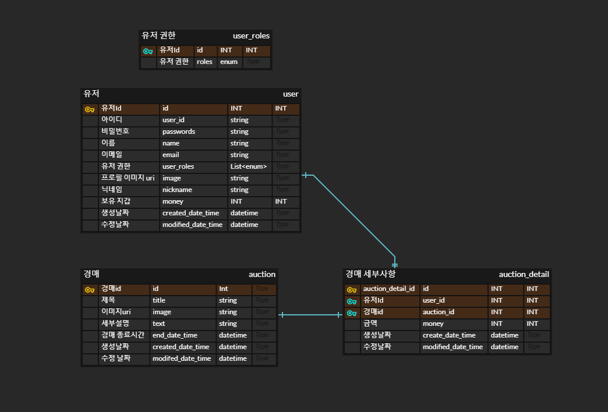

# 당근 프로젝트
자신이 가지고 있는 중고 물품을 경매에 올리면 다른 사람들은 보유하고 있는 포인트로 경매를 시작한다. 포인트는 처음 1000포인트로 시작하며 오로지 경매를 통해 포인트를 소모하고 획득할수있다. 
## 프로젝트 기능
1. 회원가입
- 아이디, 패스워드등 개인정보를 통해 회원가입을 합니다.
- spring security 를 이용하여 회원가입를 합니다.
2. 로그인
- 아이디, 패스워드를 입력하면 jwt토큰을 발급합니다.
- 이후 jwt토큰을 통해 로그인상태를 유지합니다.
3. 회원 정보 관리
- 프로필이미지, 닉네임를 수정할수 있습니다
4. 물건을 경매에 올리기
- 물건의 사진, 최소 입찰 포인트, 기간(최소 25시간, 최대 72시간)를 등록합니다.
5. 물건을 찾을수있는 검색
- 본인이 원하는 물건을 찾기위해 검색할 수 있는 기능입니다.
- 엘라스틱 서치를 활용
6. 경매에 올라간 물건에 입찰한다
- 현재 입찰중인 금액에 일정이상(5%)상향된 금액이상만 입찰가능하다
- 트랜젝션을 통해 동시성 이슈를 방지한다.
7. 현재 내가 진행중인 경매목록을 불러온다
- 내가 입찰중인 경매인지, 다른 누군가가 상위 입찰인지 알려주고 입찰 가능한 최소금액을 알려준다.
- websocket을 통해 본인이 진행하는 경매의 변화를 받는다.
8. 경매 종료 시간이 됬을때 경매 결과를 반영한다
- 입찰자가 없다면 아무런 변화 없이 종료된다
- 입찰자가 존재한다면 입찰자의 포인트를 차감하고 경매 올린사람의 포인트를 올린다
- 종료 시간에 맞춰 자동으로 실행해야 하기 때문에 매 분마다 가장 먼저 처리할 경매를 확인하여 입찰 종료를 실행한다.
- 종료 시간을 매일 00시에 db에서 당일분만 가져와 정~~~~렬하여 redis에 저장하여 가장 먼저 처리해야할 경매를 종료시킵니다.
9. 내가 올린 진행중 혹은 완료된 경매 목록을 불러온다
- 경매 이름, 입찰자, 입찰금액(진행중이라면 현재 입찰금액)을 불러온다.

## ERD

## 프로젝트 사용 기술
- spring boot
- java 11
- spring security
- redis
- mysql
- websocket
- amazon s3